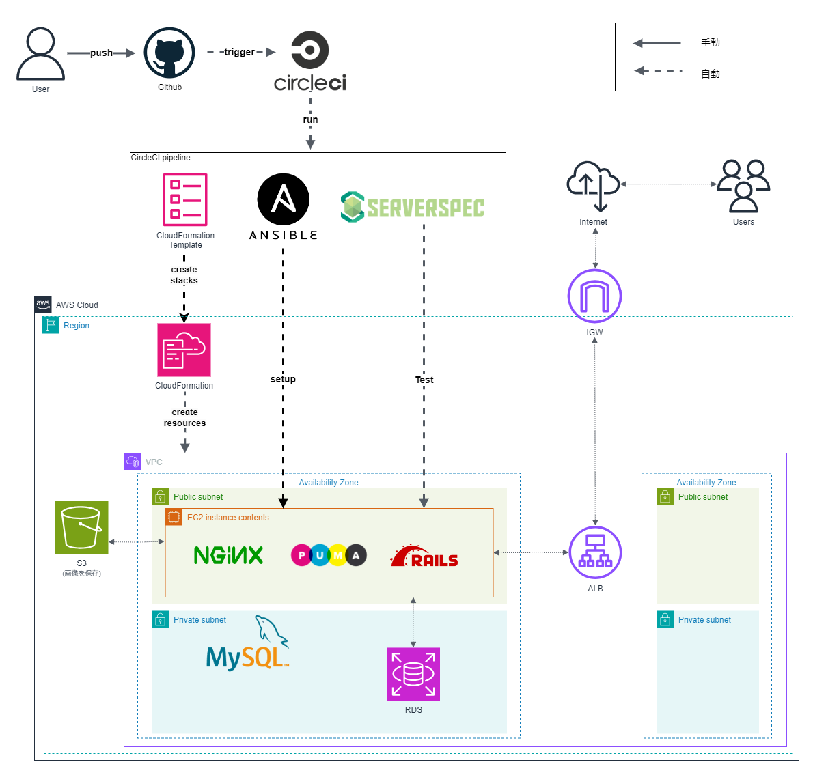

# RaiseTech AWSコース
## 概要
### CRUD処理を行うRailsアプリケーションを稼働させるインフラストラクチャの自動構築を行う。

## 自動構築の流れ
CircleCIを使用して次のようにインフラストラクチャを自動構築した。([**第13回課題用リポジトリ**](https://github.com/ryu-f67/AWS_lecture13.git)参照)
1. CloudFormationでVPC・EC2・RDS・ALB・S3のAWS環境を自動構築
2. Ansibleでサーバーの構成をコード化し、サーバー構築とアプリのデプロイを自動化
3. Serverspecで構築したサーバーに対して自動でテスト

## 構成図

## 学習記録
RaiseTechのAWSコースを受講した記録は以下の通りです。
|No.|学習テーマ|学習内容|提出課題|
|:---:|---|---|---|
|1|Railsアプリケーションの起動 （第1~3回講座）|- AWSアカウント作成 - IAM設定 - Cloud9作成|ー|
|2||- GitHub初期設定 - リポジトリ作成からプルリクエスト実施|[lecture02.md](./lecture02.md)|
|3||- Railsアプリケーションのデプロイ - APサーバー,DBサーバーについて|[lecture03.md](./lecture03.md)|
|4|AWS上でのネットワークの手動構築とアプリケーション起動 （第4~9回講座）|- VPC,EC2,RDSの作成 - EC2とRDSの接続確認|[lecture04.md](./lecture04.md)|
|5||- EC2でアプリケーションのデプロイ - ALB,S3の組込み - AWS構成図の作成|[lecture05.md](./lecture05.md)|
|6||- CloudTrailのイベント確認 - CloudWatchアラームの設定 - AWS利用料の見積作成|[lecture06.md](./lecture06.md)|
|7||- AWSのセキュリティ対策|[lecture07.md](./lecture07.md)|
|8||- 第4・5回講義課題の実演|ー|
|9||- 第4・5回講義課題の実演|ー|
|10|Infrastructure as codeの実践 （第10~15回講座）|- CloudFormationでAWS環境をコード化|[lecture10.md](./lecture10.md)|
|11||- Serverspecのテスト|[lecture11.md](./lecture11.md)|
|12||- CircleCIでサンプルコンフィグを起動|[lecture12.md](./lecture12.md)|
|13||- CircleCiでCloudFormation、Ansible、Serverspecを自動で実行しアプリケーションを起動|[lecture13.md](./lecture13.md)|
|14||- 第13回講義課題の実演 - AWS構成図と自動化処理がわかる図を作成 - リポジトリのREADME作成|ー|
|15||- 第13回講義課題の実演|ー|
|16|エンジニアとしての心得|- 現場で必要な技術や知識 - 現場での立ち振る舞い|ー|

