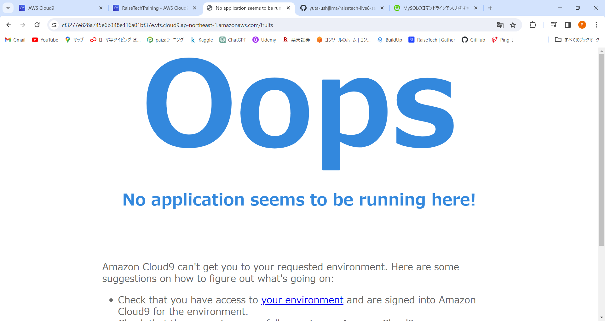
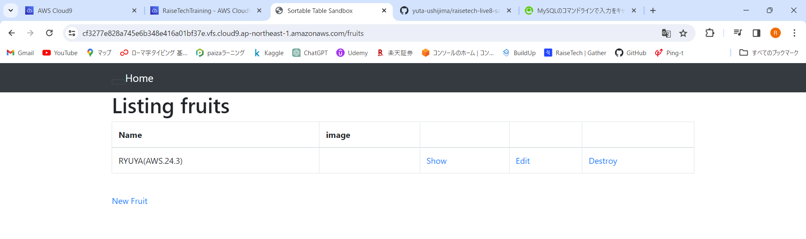

# 第3回課題
## 1. AP サーバーについて調べる
- AP サーバーの名前とバージョンを確認。
  - Puma version: 5.6.8 (ruby 3.1.2-p20)
  
- AP サーバーを終了させた場合、引き続きアクセスできるかどうか。
  - AP サーバーを終了させた場合、アクセスできなくなる。
  

## 2. DB サーバーについて調べる。
- サンプルアプリケーションで使った DB サーバーの名前とバージョンの確認。
  - mysql  Ver 8.0.36 for Linux on x86_64
  
- DB サーバーを終了させた場合、引き続きアクセスできるかどうか。
  - DB サーバーを終了させた場合、アクセスできなくなる。
  
- Rails の構成管理ツールの名前は何か。
  - Bundler

## 3. Webアプリへアクセス

## 4. 学んだこと、感じたこと
- ターミナルで使用するコマンドが多く、覚えるのが大変。
  - ターミナル操作のコマンド
    - ディレクトリの移動
      '''
      cd dir
      '''
    - カレントディレクトリのファイル一覧を表示
      '''
      ls
      '''
    - ディレクトリの作成
      '''
      mkdir dirname
      '''
    - ファイルの作成
      '''
      touch new_filename
      '''
    - ファイルのコピー作成
      '''
      cp original_file copy_file
      '''
    - ターミナルのクリア
      '''
      clear
      '''
    - ファイル内容を1画面ずつ表示
      '''
      less filename
      '''
  - MySQLサーバーに関するコマンド
    - MySQLの起動
      '''
      sudo service mysqld start
      '''
    - MySQLの停止
      '''
      sudo service mysqld stop
      '''
    - MySQLの状態確認
      '''
      service mysqld status
      '''
- errorがでたときの対処に苦戦した。
- スムーズにデプロイできるように反復練習が必要。