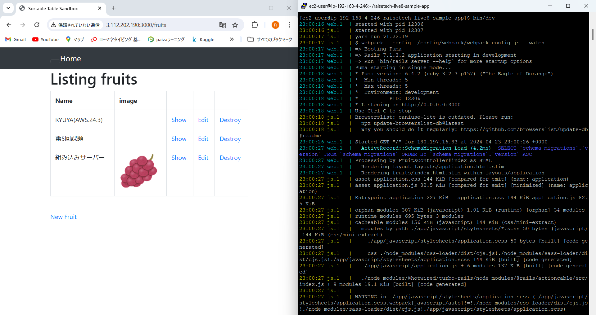
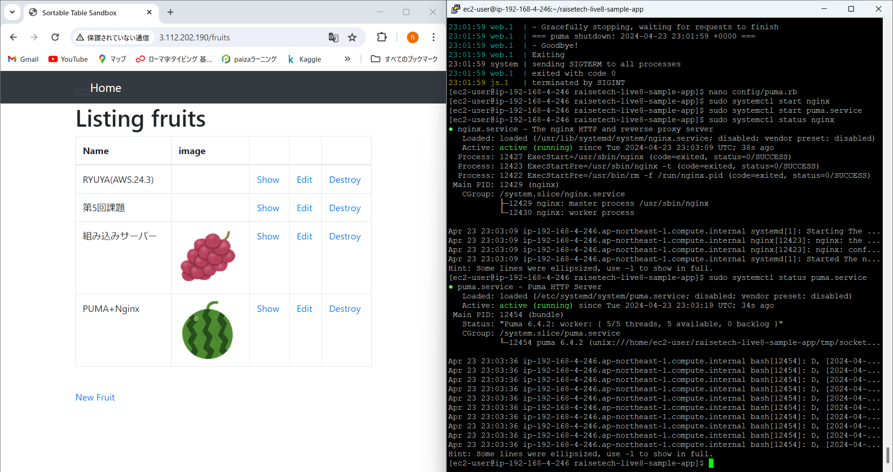
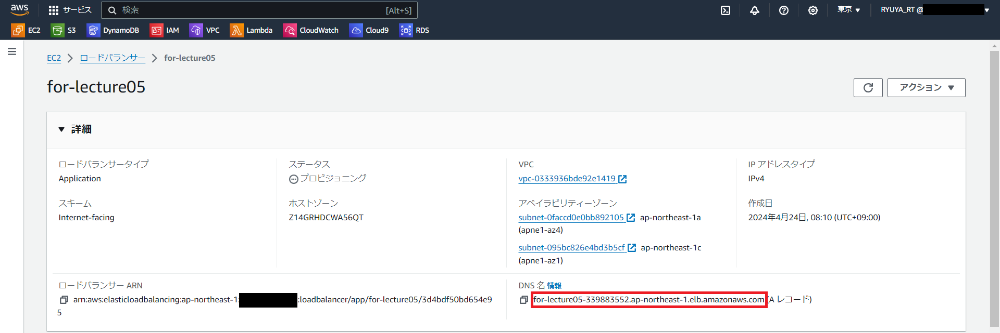
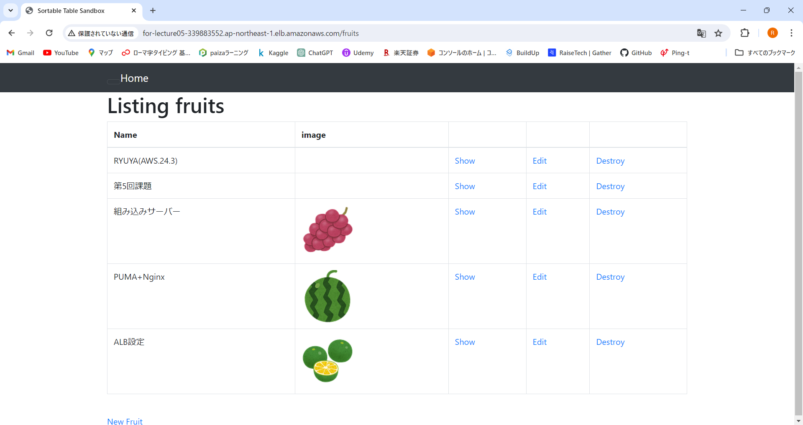
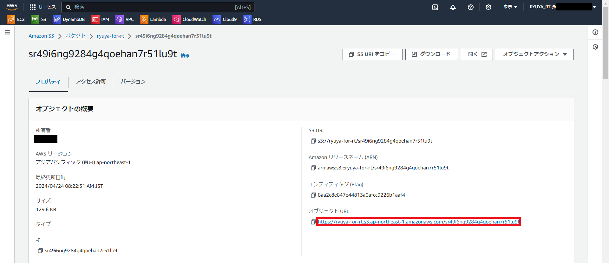
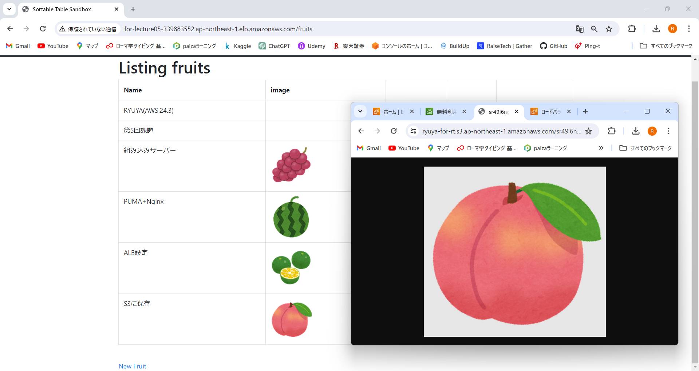
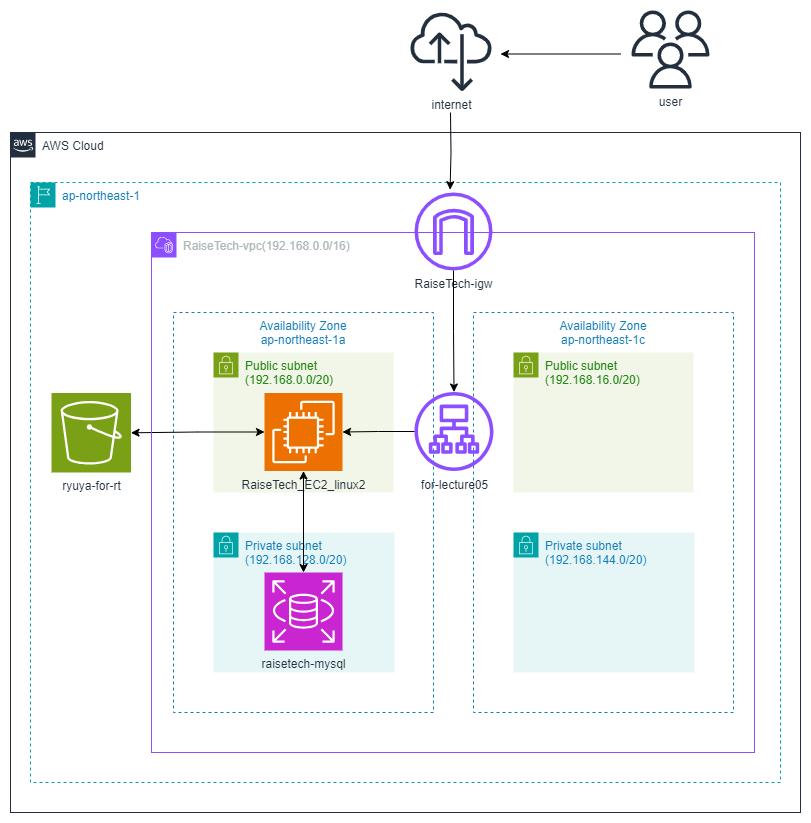

# 第5回課題

## EC2上にサンプルアプリケーションをデプロイ

### 1.組み込みサーバーだけで動作
  

### 2.Nginx+Pumaで動作
  

### 3.ALBを追加して動作
  
  

### 4.S3を追加して動作
  
  

### 5.環境の構成図作成
  

### 6.課題に取り組んで感じたこと
- 今回の課題はほとんどが初めて行うことだった。今後の課題でも必要な情報がたくさん含まれていると思うので、今回から[memo](memo)フォルダに自身が行ったことを残していこうと思う。
- エラー発生と解消を何度も繰り返したため、logからエラーを読み取って解消する一連作業に慣れてきた。