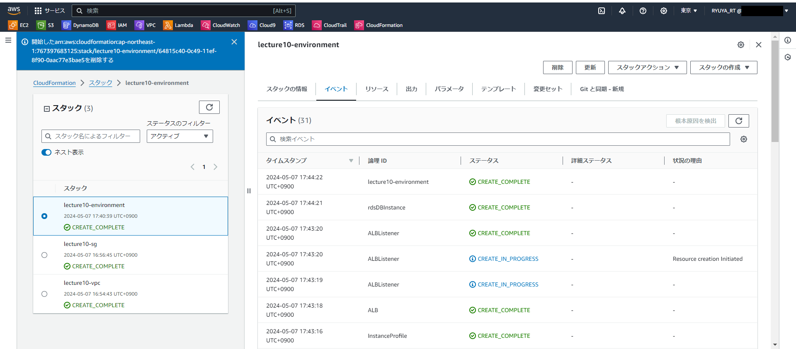
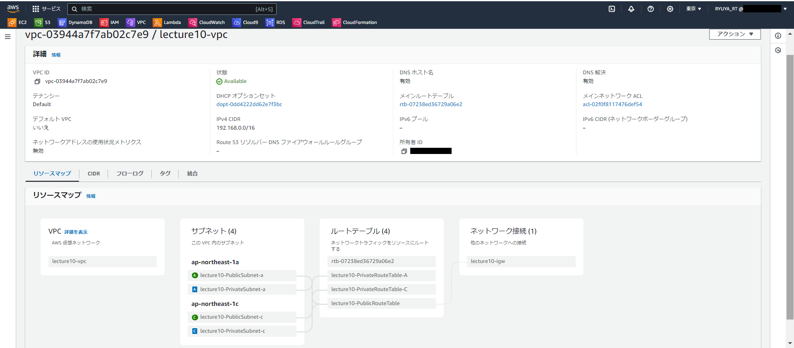
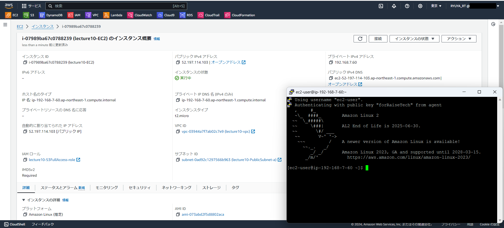
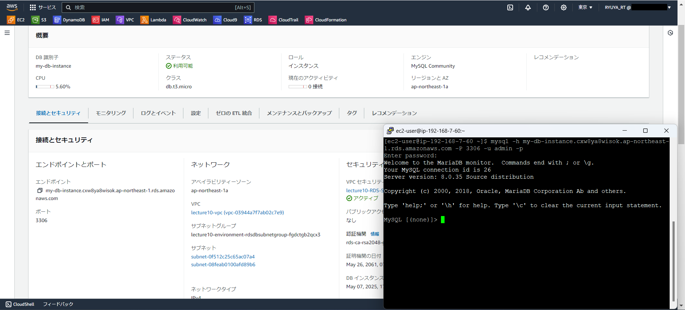
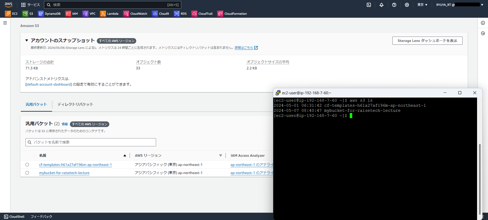
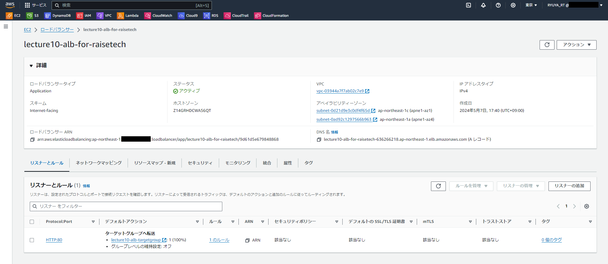

# 第10回課題
## 1.CloudFormationを利用して、現在までに作った環境をコード化する。
- VPC+subnet作成 [**create_vpc.yml**](cloudformation/create-vpc.yml)  
- security group作成 [**create_securitygroup.yml**](cloudformation/create-securitygroup.yml)  
- EC2,RDS,S3,ALB作成 [**create_resources.yml**](cloudformation/create-resources.yml)  
  
- スタック作成  

  
- VPC  

  
- EC2  

  
- RDS  

  
- S3  

  
- ALB  

  
## 2.課題に取り組んで感じたこと
- propertiesの各項目が何を示しているのかを調べるのに苦労した。
- CloudFormationのドキュメントを読みながらコードを書くことで、マネジメントコンソールの画面で環境構築を行うより、リソースの内部で様々な設定や定義を行っていることを理解することができた。