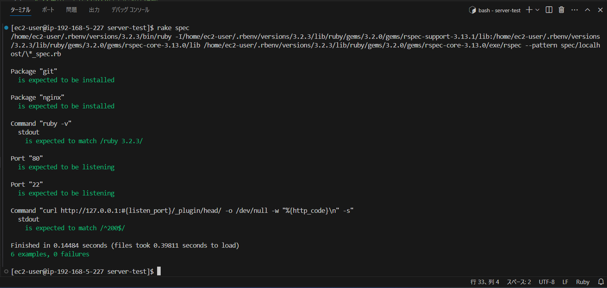

# 第11回課題
## ServerSpecのテストが成功することを確認する。
- [**ServerSpec**](https://serverspec.org/) をインストール
```sh
$ gem install serverspec
```
  
- 設定ファイルを生成  
```sh
$ serverspec-init
```

- サンプルを基に sample_spec.rb をカスタマイズする  
```ruby
require 'spec_helper'

listen_port = 80

# gitがインストールされているか確認
describe package('git') do
  it { should be_installed }
end

# Nginxがインストールされているか確認
describe package('nginx') do
  it { should be_installed }
end

# rubyが指定のバージョンでインストールされているか確認
describe command('ruby -v') do
  its(:stdout) { should match /ruby 3.2.3/ }
end

# listen_port(80番ポ－ト)がlistenしているか確認
describe port(listen_port) do
  it { should be_listening }
end

# 22番ポ－トがlistenしているか確認
describe port("22") do
  it { should be_listening } 
end

# curlで200が返ってくるか確認 
describe command('curl http://127.0.0.1:#{listen_port}/_plugin/head/ -o /dev/null -w "%{http_code}\n" -s') do
  its(:stdout) { should match /^200$/ }
end
```
  
テストの実行  
```sh
$ rake spec
```
  
テストの結果  

