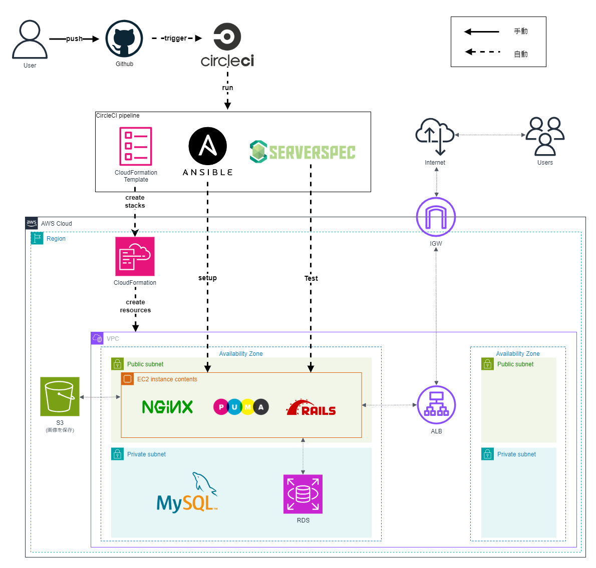
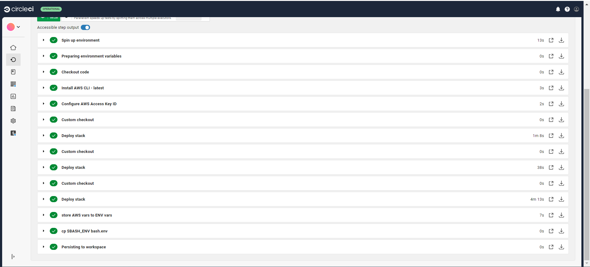
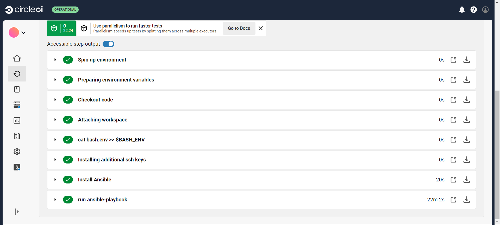
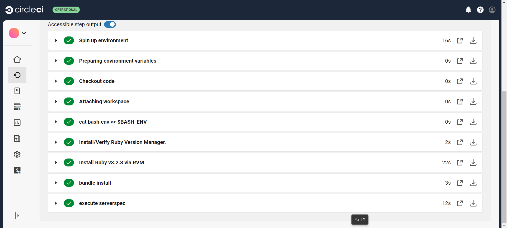
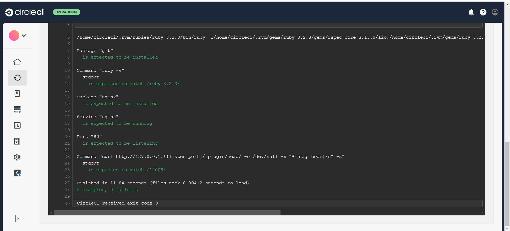
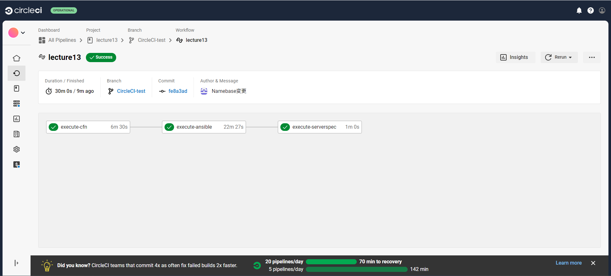
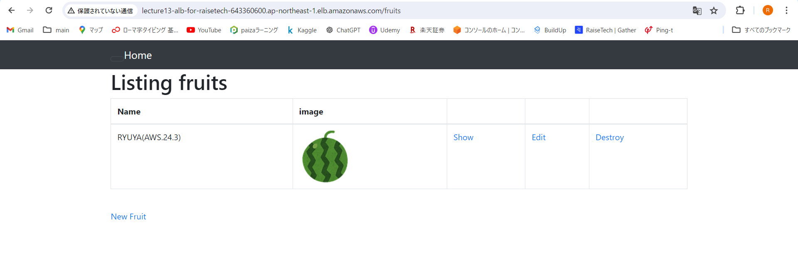

# 第13回課題
### CircleCIにCloudFormationやServerSpec、Ansibleの処理を追加し実行する。
これまでの課題とファイルが混在しないように別のリポジトリを作成し実行した。  
CircleCI実行の詳細は[**第13回課題用リポジトリ**](https://github.com/ryu-f67/AWS_lecture13.git)を参照。  
今回の課題で作成した構成図は以下の通りである。

## CircleCIのコンソールで環境変数を設定する。
- AWS_ACCESS_KEY_ID(アクセスキー)
- AWS_SECRET_ACCESS_KEY(シークレットアクセスキー)
- AWS_DEFAULT_REGION(リージョン)
- AWS_DB_PW(RDSのパスワード)
## CircleCIの実行
### CloudFormationのテンプレートを用いてスタックの作成
CircleCIにCloudFormationテンプレートを実行する処理を追加し実施  

### Ansible-Playbookの実行
CircleCIにAnsibleのPlaybookを実行する処理を追加し実施  

### Serverspecによるテスト実行
CircleCIにServerspecのテストを実行する処理を追加し実施  

### CircleCI結果

### ALBのDNS名でアクセスし、アプリが動作することを確認

  
## 課題に取り組んで感じたこと
- ElasticIPを使用せずに環境構築をしたため、AnsibleとServerspecを動的IPに対応させるのに苦労した。
- トライ&エラーを繰り返し、successするまで多くの時間を要した。successまでの試行回数を減らせるように理解を深めることを今後の課題とする。
- 他の人が書いたコードを読むことはとても勉強になると改めて感じた。今後もいろんなコードを参考にし、きれいでわかりやすいコードを書く技術を身に着ける。
